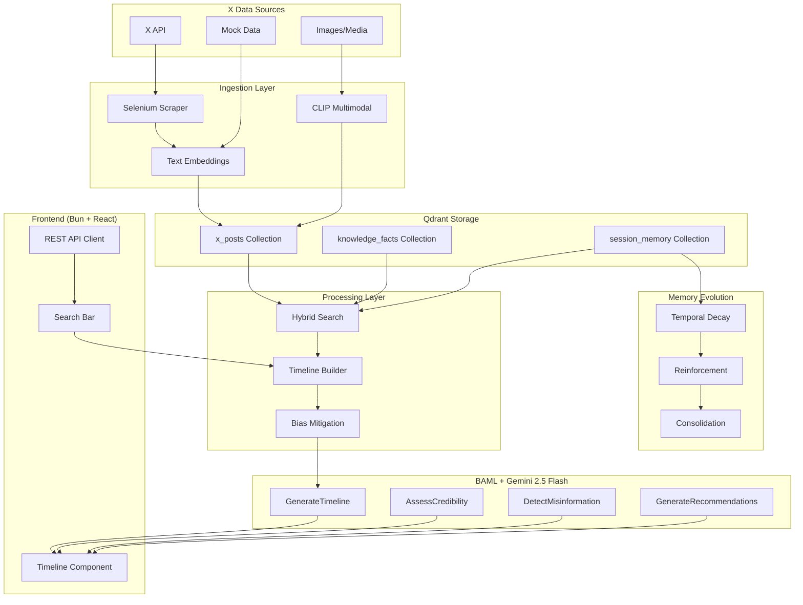

# Chronofact.ai

AI-powered fact-based news service that builds accurate, verifiable event timelines from X (Twitter) data using Qdrant vector database and BAML for structured LLM output. Built for the **Convolve 4.0 Pan-IIT AI/ML Hackathon** - Qdrant Challenge.

**Author**: Ayush4513 (sharmayush045@gmail.com)

## 🎯 Hackathon Problem Statement

This project addresses the **Misinformation & Digital Trust** societal challenge from the Qdrant Problem Statement, implementing:

- ✅ **Search** - Hybrid semantic + keyword retrieval over multimodal data
- ✅ **Memory** - Persistent, evolving knowledge with decay and reinforcement
- ✅ **Recommendations** - Context-aware suggestions and decision support

## Features

### Core Features
- **Timeline Generation** - Build chronological event timelines from X posts
- **Credibility Assessment** - Evaluate trustworthiness of claims and sources
- **Misinformation Detection** - Identify potential misinformation patterns
- **Hybrid Search** - Combine vector similarity with keyword matching

### Advanced Features (Convolve 4.0)
- **🖼️ Multimodal Embeddings** - CLIP-based image-text cross-modal search
- **🧠 Memory Evolution** - Temporal decay, reinforcement, and memory consolidation
- **⚖️ Bias Mitigation** - Source diversity enforcement and bias detection
- **🔍 Evidence-Based Outputs** - BAML-verified structured responses with traceability

## Quick Start

### Prerequisites

- Python 3.11+
- [uv](https://docs.astral.sh/uv/) package manager
- [Bun](https://bun.sh/) for frontend
- Google AI API key (for Gemini 2.5 Flash)

### Installation

```bash
git clone https://github.com/Ayush4513/Chronofact.ai.git
cd Chronofact.ai

# Python setup
uv venv && source .venv/bin/activate && uv sync
cp .env.example .env  # Add your GOOGLE_API_KEY
```

### Start the Application

```bash
# Terminal 1: Backend API
python -m src.api  # http://localhost:8000

# Terminal 2: Frontend
cd frontend && bun install && bun dev  # http://localhost:3000
```

### Setup Qdrant

```bash
./setup-qdrant.sh local    # Local persistent storage
./setup-qdrant.sh docker   # Docker container
./setup-qdrant.sh test     # Test connection
```

### Initialize

```bash
python -m src.cli init  # Create collections and download models
```

## Usage

### CLI Commands

```bash
# Generate a timeline
python -m src.cli query "Mumbai floods 2026" --limit 10

# Verify a claim
python -m src.cli verify --text "Schools are closing tomorrow" --author user123

# Detect misinformation
python -m src.cli detect --text "This is HUGE news they're hiding!!!"

# Get recommendations
python -m src.cli recommend "Maharashtra elections"

# Ingest mock data
python -m src.cli ingest mock
```

### Web Interface

Open http://localhost:3000 for:

- **Search bar** for generating timelines
- **Timeline** with color-coded credibility badges
- **Misinformation detection** panel
- **Recommendations** sidebar
- **API status** indicator

### API Endpoints

| Method | Endpoint | Description |
|--------|----------|-------------|
| GET | `/health` | Health check |
| POST | `/api/timeline` | Generate timeline |
| POST | `/api/verify` | Verify claim |
| POST | `/api/detect` | Detect misinformation |
| POST | `/api/recommend` | Get recommendations |
| GET | `/api/config` | Get configuration |
| POST | `/api/search` | Search posts |

## Project Structure

```
Chronofact.ai/
├── src/                       # Python backend
│   ├── api.py                 # FastAPI endpoints
│   ├── cli.py                 # CLI commands
│   ├── config.py              # Configuration
│   ├── embeddings.py          # Text embeddings (Sentence Transformers)
│   ├── multimodal.py          # 🆕 CLIP multimodal embeddings
│   ├── memory_evolution.py    # 🆕 Memory decay/reinforcement
│   ├── bias_mitigation.py     # 🆕 Source diversity & bias detection
│   ├── ingestion.py           # X data ingestion
│   ├── qdrant_setup.py        # Qdrant client setup
│   ├── search.py              # Hybrid search
│   └── timeline_builder.py    # Timeline generation
├── frontend/                   # React + shadcn/ui frontend
│   ├── src/
│   │   ├── App.tsx            # Main app component
│   │   ├── frontend.tsx       # React entry point
│   │   ├── components/
│   │   │   ├── ui/            # shadcn components
│   │   │   └── TimelineItem.tsx
│   │   └── lib/
│   │       └── api.ts         # API client
│   ├── index.html
│   ├── bunfig.toml            # Bun config with API proxy
│   └── package.json
├── baml_src/                   # BAML schema definitions
├── baml_client/                # Generated BAML client
├── docs/                       # Documentation
├── data/                       # Data storage
├── tests/                      # Test suite
├── setup-qdrant.sh
├── docker-compose.simple.yml
└── pyproject.toml
```

## 🖼️ Multimodal Support

Chronofact.ai supports **cross-modal search** using CLIP embeddings:

```python
from src.multimodal import get_multimodal_embedder

embedder = get_multimodal_embedder()

# Encode text for cross-modal search
text_emb = embedder.encode_text("flood damage in Mumbai", use_clip=True)

# Encode image
image_emb = embedder.encode_image("path/to/image.jpg")

# Combined multimodal embedding
combined_emb = embedder.encode_multimodal(
    text="Heavy rainfall warning",
    image="weather_map.png",
    fusion_method="text_weighted"  # 70% text, 30% image
)

# Cross-modal search (find images with text query)
results = embedder.cross_modal_search(
    query="flooded streets",
    candidates=image_candidates,
    top_k=10
)
```

## 🧠 Memory Evolution

Implements **evolving memory** with decay, reinforcement, and consolidation:

```python
from src.memory_evolution import MemoryEvolution

memory = MemoryEvolution(qdrant_client, "session_memory")

# Store memory with evolution metadata
memory_id = memory.store_memory(
    content="User interested in Mumbai weather",
    embedding=query_embedding,
    initial_relevance=1.0,
    memory_type="preference"
)

# Retrieve and automatically reinforce accessed memories
memories = memory.retrieve_and_reinforce(
    query_embedding=current_query,
    limit=10,
    min_relevance=0.3,
    apply_decay=True  # Apply temporal decay
)

# Apply global decay (run daily via cron)
updated, deleted = memory.apply_global_decay()

# Consolidate similar memories to reduce redundancy
consolidated = memory.consolidate_similar_memories(
    similarity_threshold=0.85
)

# Get memory statistics
stats = memory.get_memory_stats()
# Returns: {total_memories, avg_relevance, low_relevance_count, ...}
```

### Memory Evolution Features

| Feature | Description |
|---------|-------------|
| **Temporal Decay** | Memories lose relevance over time (exponential decay) |
| **Reinforcement** | Accessed memories gain relevance boost |
| **Consolidation** | Similar memories are merged to reduce redundancy |
| **Threshold Deletion** | Memories below 0.2 relevance are auto-deleted |

## ⚖️ Bias Mitigation

Ensures **fair representation** and **source diversity**:

```python
from src.bias_mitigation import BiasMitigation, check_timeline_bias

checker = BiasMitigation()

# Analyze source diversity
diversity = checker.analyze_source_diversity(events)
# Returns: {score, unique_sources, unique_authors, warnings, ...}

# Detect content bias (emotional language, polarization)
bias = checker.detect_content_bias(texts)
# Returns: {bias_score, emotional_ratio, polarizing_ratio, flags, ...}

# Check temporal distribution
temporal = checker.analyze_temporal_distribution(events)
# Returns: {is_balanced, unique_hours, unique_dates, warnings}

# Enforce diversity in event selection
diverse_events = checker.enforce_diversity(events, target_count=10)

# Generate comprehensive diversity report
report = checker.generate_diversity_report(events)
# Returns: {overall_score, recommendations, all_warnings, ...}

# Quick check function
report = check_timeline_bias(timeline_events)
```

### Bias Mitigation Rules

| Rule | Threshold | Description |
|------|-----------|-------------|
| Source Concentration | < 30% | No single source dominates |
| Verified Ratio | > 40% | Minimum verified sources |
| Unique Authors | ≥ 3 | Minimum diverse voices |
| Temporal Clustering | < 50% | No single time period dominates |

## Frontend

Modern React 19 + shadcn/ui interface served by Bun.

### Running

```bash
cd frontend
bun install && bun dev  # http://localhost:3000
```

### Features

- **React 19** with TypeScript
- **shadcn/ui** components (Card, Button, Input, etc.)
- **Tailwind CSS v4** styling
- **Lucide React** icons
- **API proxy** via bunfig.toml (proxies /api/* to localhost:8000)
- **Dark theme** by default
- **Credibility badges** (green/yellow/red)
- **Smooth animations**

### Production Build

```bash
cd frontend
bun run build && bun start
```

## Configuration

### Environment Variables

| Variable | Description | Default |
|----------|-------------|---------|
| `GOOGLE_API_KEY` | Google AI API key for Gemini | Required |
| `QDRANT_MODE` | Deployment mode | local |
| `QDRANT_STORAGE_PATH` | Local storage path | ./data/qdrant |
| `QDRANT_URL` | Qdrant Cloud URL | - |
| `QDRANT_API_KEY` | Qdrant Cloud API key | - |
| `EMBEDDING_MODEL` | Sentence transformer model | all-MiniLM-L6-v2 |
| `SEARCH_LIMIT` | Default search limit | 10 |
| `MIN_CREDIBILITY` | Minimum credibility threshold | 0.3 |

### Qdrant Deployment Modes

1. **local** - Local persistent storage (recommended)
2. **docker** - Docker container
3. **memory** - In-memory (testing only)
4. **cloud** - Qdrant Cloud managed service

## Development

```bash
# Run tests
uv run pytest

# Lint and format
uvx ruff check src/ tests/
uvx ruff format src/ tests/
```

## Architecture



### Technology Stack

| Layer | Technology |
|-------|------------|
| **Database** | Qdrant (vector storage & search) |
| **LLM** | Gemini 2.5 Flash via BAML |
| **Text Embeddings** | Sentence Transformers (all-MiniLM-L6-v2) |
| **Multimodal** | CLIP (clip-ViT-B-32) |
| **Backend API** | FastAPI |
| **CLI** | Typer |
| **Frontend** | React 19 + shadcn/ui (Bun) |
| **Styling** | Tailwind CSS v4 |

## Convolve 4.0 Hackathon Compliance

### Mandatory Requirements ✅

| Requirement | Implementation |
|-------------|----------------|
| Qdrant as primary vector search | `qdrant_setup.py`, `search.py` |
| Meaningful vector embeddings | `embeddings.py`, `multimodal.py` |
| Search/Memory/Recommendation | `search.py`, `memory_evolution.py`, BAML functions |

### System Expectations ✅

| Expectation | Implementation |
|-------------|----------------|
| Multimodal Retrieval | CLIP embeddings for images + text |
| Memory Beyond Single Prompt | Decay, reinforcement, consolidation |
| Societal Relevance | Misinformation detection, digital trust |
| Evidence-Based Outputs | BAML schema validation, source citation |
| Bias/Safety Handling | `bias_mitigation.py` |

## License

MIT
